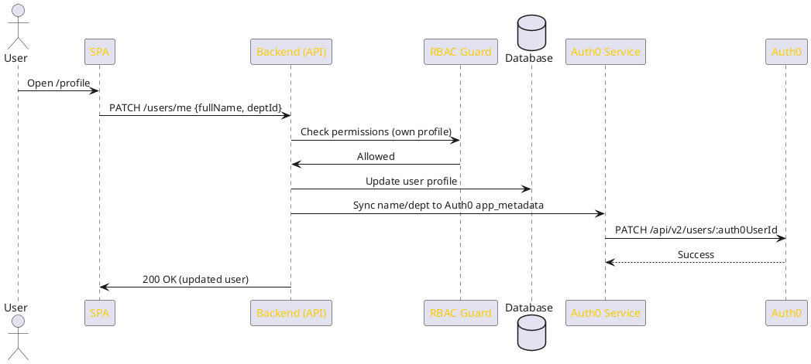

```plantuml
@startuml
'!theme sketchy
'!option handwritten true

skinparam classFontColor #ffcc00
skinparam classFontSize 10
skinparam classFontName Courier
skinparam sequenceMessageAlign center
skinparam sequenceParticipantFontColor #ffcc00
skinparam sequenceActorFontColor #1e1e1e
skinparam databaseFontColor #1e1e1e

actor User as U
participant "SPA" as SPA
participant "Backend (API)" as BE
participant "RBAC Guard" as RBAC
database "Database" as DB
participant "Auth0 Service" as Auth0S
participant "Auth0" as Auth0

U -> SPA : <font color=#1e1e1e>Open /profile</font>
SPA -> BE : <font color=#1e1e1e>PATCH /users/me {fullName, deptId}</font>
BE -> RBAC : <font color=#1e1e1e>Check permissions (own profile)</font>
RBAC -> BE : <font color=#1e1e1e>Allowed</font>
BE -> DB : <font color=#1e1e1e>Update user profile</font>
BE -> Auth0S : <font color=#1e1e1e>Sync name/dept to Auth0 app_metadata</font>
Auth0S -> Auth0 : <font color=#1e1e1e>PATCH /api/v2/users/:auth0UserId</font>
Auth0 --> Auth0S : <font color=#1e1e1e>Success</font>
BE -> SPA : <font color=#1e1e1e>200 OK (updated user)</font>
@enduml
```